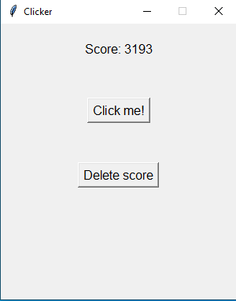

# Python clicker

A simple python clicker with saving the score with the built-in library **tkinter**\
This is my first repository, so please don't judge me too harshly



## Description

The program is a simple tkinter clicker. When you click the **'Click Me!'** button, the score increases by **1**\
**(WARNING)** When you click the **'Delete score'** button, the score **resets to zero**!

## Features

Click counter: Increases by 1 each time the button is clicked.
Saving results: The current result is saved in score.txt and restored when the program is restarted.
Reset function: A button to reset the results.
No external dependencies: Only the built-in tkinter library is used.

## How to use

1. Make sure you have **Python 3.x.x** installed
2. Download or clone the repository:
```bash
git clone https://github.com/AmirCode228/python-clicker.git
```
3. Navigate to the project folder:
```bash
cd path/to/folder/
```
4. Run the program:
```bash
python main.py
```
5. Press the button to increase your score!

## Project structure

python_clicker/
│
├── README.md
├── clicker_photo.png
├── main.py          # Main program code (GUI and clicker logic)
└── score.txt      # File to save the current score

## Technical Details
Programming Language: Python 3.x.x
GUI Library: tkinter (built‑in)
Data Persistence: Text file (score.txt)
Compatibility: Windows, macOS, Linux
